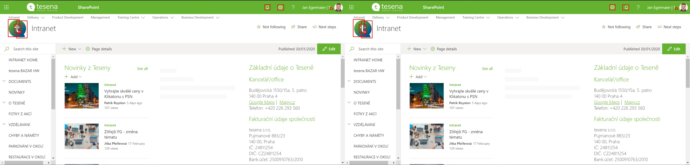

# WatchUI

[](https://github.com/psf/black)

## [Documentation](https://tesena-smart-testing.github.io/WatchUI/) | [Tesena](https://www.tesena.com/) | [Pypi](https://pypi.org/project/WatchUI/)

## Important notice for users

WatchUI 2.0 brings breaking changes. Dev team decided to streamline the library and focus it solely on the image and text comparison. This allows us to remove the implicit dependency on browser automation libraries - namely SeleniumLibrary, which was implicit part of the library via RF `BuiltIn()` import of the SeleniumLibrary instance.

This is no longer the case - user of the WatchUI therefore **can and have to choose, what UI automation library will use** and provide screenshots to the WatchUI keywords to be compared. It could be now used with SeleniumLibrary, Browser library, Sikuli, Appium or any other UI library where visual validation is required.

Version 1.x.x is no longer supported, but it is still available on [Pypi](pip install WatchUI==1.0.11).

### Basic Info

Custom library for works with image, pdf and tesseract with RF.

### Folder structure

```
WatchUI
└── .github/workflows           # Folder with CI for github actions
└── assets                      # Folder with images used for documantation as well as test data
└── test                        # Folder with example how to write rf test.
│    └── unit_tests             # Pytest unit test cases
│    └── test.robot             # File with simeple Robot Framework TCs
└── WatchUI                     # Folder with WatchUI library
│    └── WatchUI.py             # Main library file
│    └── IBasics                # Basic utilities and error handling
│    └── Keywords               # Keywords for working with images, PDFs and text(tesseract)
└── README.MD                   # Here you are :-)
└── setup.py                    # File for easy setup use with pip install .
```

### Install

You can find detail in [Documentation](https://procesor2017.github.io/WatchUI/) but basically use pip:

```
pip install WatchUI
```

or some python dependencies management tools, like [pipenv](https://pipenv.pypa.io/en/latest/) or [poetry](https://python-poetry.org/) and their respective methods of libraries installation.

### Sample results

_Image where the differences are stored + You can see two black box in left corner. These black box are ignored during comparison._


_The red rectangles outlining missing elements on compared screens_


